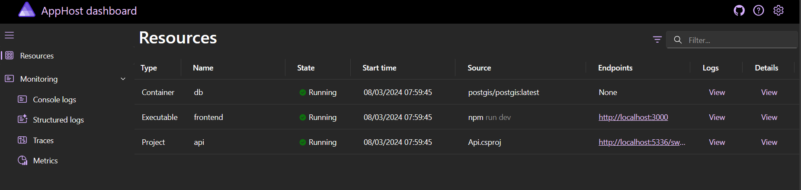
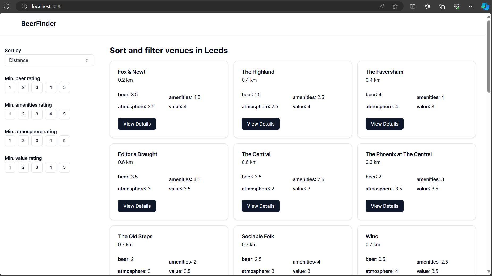
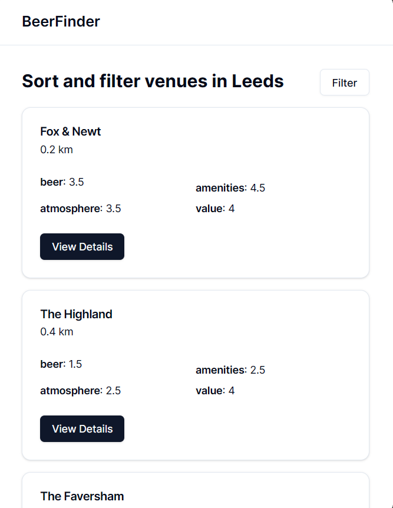
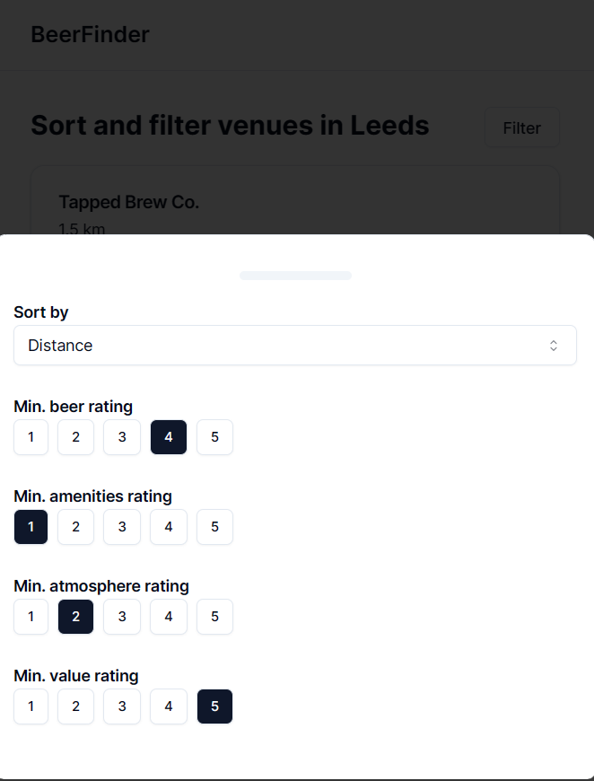
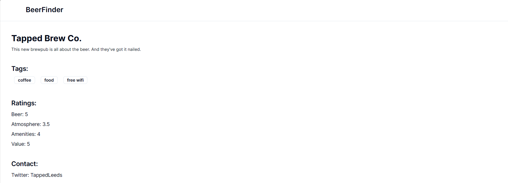
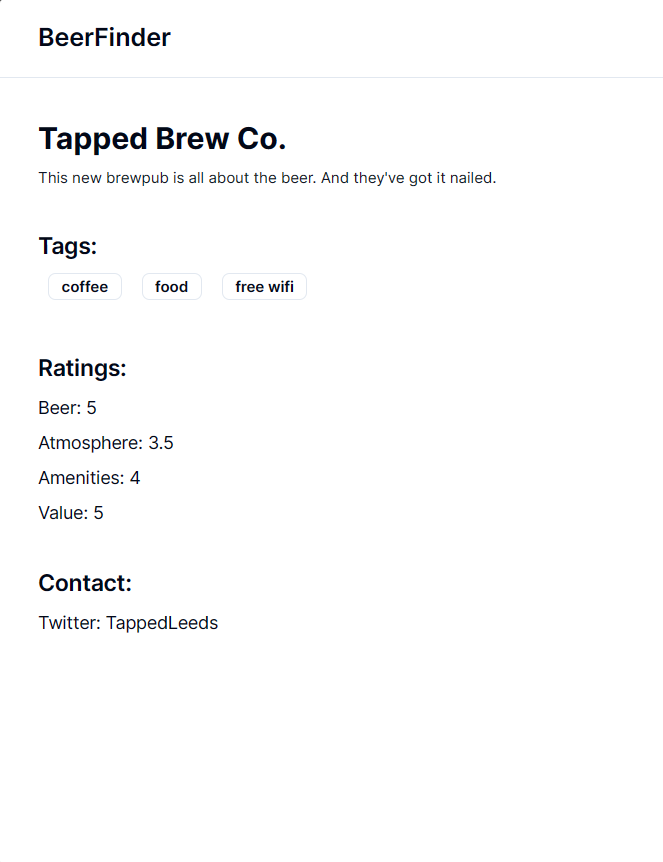

# BeerFinder

A demo NextJS application for filtering & searching for venues

Contents:

- [Solution Structure](#solution-structure)
- [Improvements](#improvements-with-more-time)
- [Running the Application](#running-the-application)
- [Running the E2E Tests](#runnin-the-e2e-tests)
- [Generating an updated client package](#generating-an-updated-client-package)
- [Screenshots](#screenshots)

## Solution Structure

- `/src/Api`: A .NET API for serving venue data. This was created to be functional but wasn't the focus of the task so is implemented in a fairly rudimentary style
- `/src/WebUI`: A NextJS web application for displaying and filtering venue data
  - `/app`: App Router folder, pages are named page.tsx and components are nested in the components folder
  - `/components`: 'Dumb' react components (e.g. Buttons, etc)
  - `/lib`: Library code, for example, a client SDK for consuming the API
  - `/cypress`: Cypress E2E tests for the UI
- `/src/AppHost`: .NET Aspire App Host (optional method for running the project in local dev)
- `/src/ServiceDefaults`: Some sensible defaults for things like observability to be used in the API (added OOTB by aspire)

## Improvements (with more time)

- `Gated quality checks`: On a proper app I'd generally have gated checks as part of a CI pipeline that runs on code reviews to check things such as

  - formatting / linting
  - tests
  - build
  - test coverage
  - static code analysis

- `Test Coverage`: There are some notable gaps in coverage as part of the task:

  - API tests
  - Accessibility tests (e.g. using cypress axe plugin)

- `Distributed Tracing & Observability`: The API is instrumented with OpenTelemetry which provides the ability to do distributed tracing. Given more time we could add the same to the NextJS application and propogate trace headers between the applications for an end-to-end view of requests

## Running the Application

### Option 1 - Using Docker

Dependencies

- Docker

build services:

```
docker-compose --build
```

Start services:

```
docker-compose up -d
```

Once started, the following urls will be available

- web: http://localhost:3000
- api: http://localhost:8080/swagger
- postgres: tcp://localhost:5432

> Note: its possible to run the dependencies in docker and other services manually (e.g. the nextjs app for local dev). To do this scale the deploy section of the service down to 0 in the docker-compose, and then run the web app manually (`npm run dev`). The config from the docker-compose will need to placed in a .env file

### Option 2 - Using .NET Aspire

Dependencies

- .NET Aspire
- Preview version of .NET (>8.0.200-preview.23624.5)
- Docker
- VisualStudio
- NodeJS

Install node modules:

```sh
cd ./src/WebUI && npm ci
```

Run the AspireAppHost project from VisualStudio, this should open the Aspire dashboard which shows all the running services like this:



## Running the E2E Tests

From `./src/WebUI` run `npm run cypress:open`

## Generating an updated client package

The frontend uses a client package generated from the OpenAPI spec of the .NET API using [openapi-generator](https://github.com/OpenAPITools/openapi-generator)

The generation of a new client package when the contract changes is done manually by running `npm run openapi` from `./src/WebUI`

## Screenshots

### Landing Page

##### Desktop:



##### Mobile:



##### Mobile (filters view):



### Details Page

##### Desktop:



##### Mobile:


